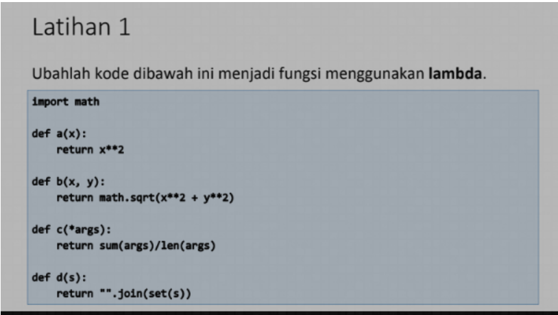
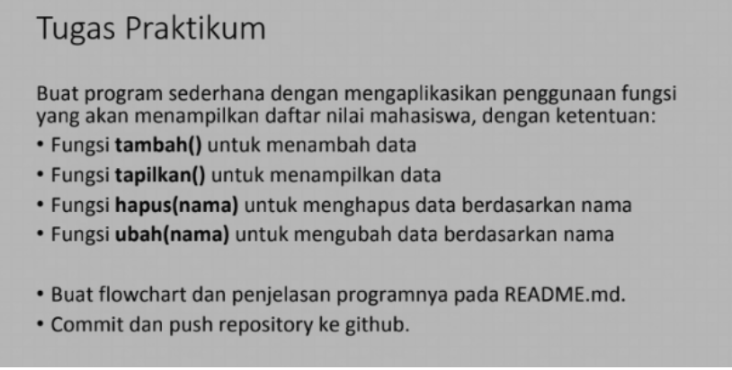
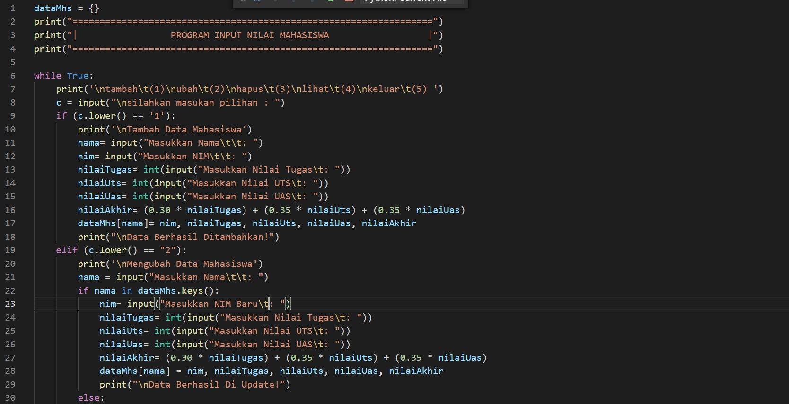
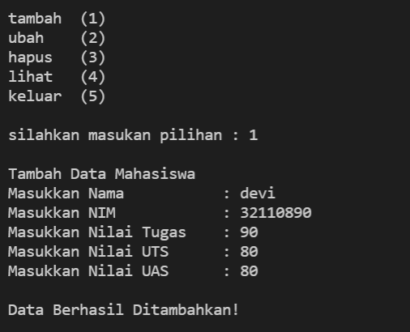
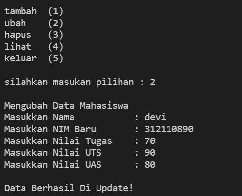
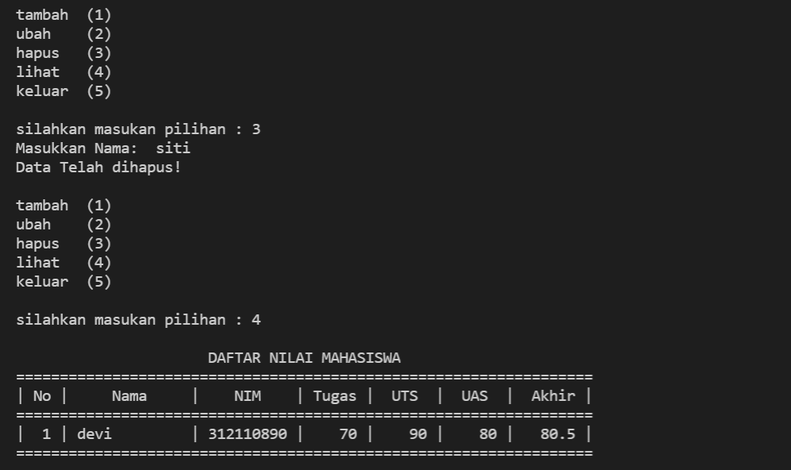
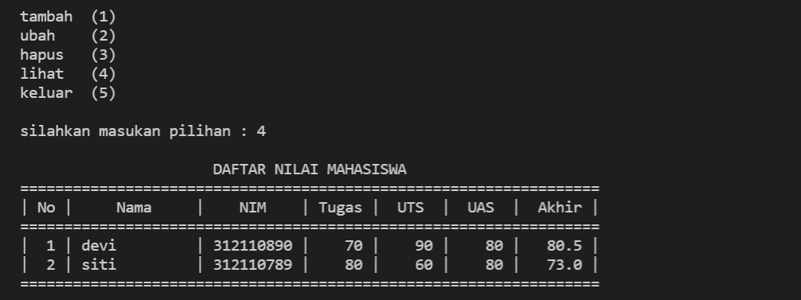
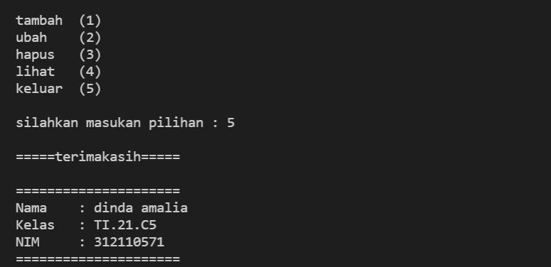

# **PERTEMUAN 11**
# **Latihan**
pada latihan 11 saya diberi soal


## jawab
nomor 1 :
> before
```py
def a(x):
    return x**2
```
> after 
```py
a=lambda x: (x**2)
```
nomor 2 :
> before
```py
def b(x,y):
    return math.sqrt(x**2 + y**2)
```
> after
```py
b=lambda x,y: math.sqrt(x**2 + y**2)
```
nomor 3
> before
```py
def c(*args):
    return sum(args)/len(args)
```
> after
```py
c=lambda *args:sum(args)/len(args)
```
nomor 4:
> before
```py
def d(s):
    return "".join(set(s))
```
> after
```py
d=lambda s: "".join(set(s))
```


# **Praktikum**

pada tugas praktium saya diberi soal sebagai berikut

 

## flowchart


## JAWAB

pertama saya membuat looping agar program terus berjalan

```py
while True:
    print('\ntambah\t(1)\nubah\t(2)\nhapus\t(3)\nlihat\t(4)\nkeluar\t(5) ')                                                                                     
    c = input("\nsilahkan masukan pilihan : ")                              
```
lalu saya membuat format if untuk memasukan pilihan ,
sebagai contoh apabila memilih (1) akan menambah data
```py
if (c.lower() == '1'):                                               
        print('\nTambah Data Mahasiswa Baru')
        nama= input("Masukkan Nama\t\t: ")                                        
        nim= input("Masukkan NIM\t\t: ")                                         
        nilaiTugas= int(input("Masukkan Nilai Tugas\t: "))                              
        nilaiUts= int(input("Masukkan Nilai UTS\t: "))                                   
        nilaiUas= int(input("Masukkan Nilai UAS\t: "))                                    
        nilaiAkhir= (0.30 * nilaiTugas) + (0.35 * nilaiUts) + (0.35 * nilaiUas)              
        dataMhs[nama]= nim, nilaiTugas, nilaiUts, nilaiUas, nilaiAkhir                         
        print("\nData Berhasil Ditambahkan!")
```
saya juga melakukan percabangan if (elif) untuk melaksanakan pilihan yang lain
```py
elif (c.lower() == '2'):                                                                    
        print('\nMengedit Data Mahasiswa')
        nama = input("Masukkan Nama: ")                                                         
        if nama in dataMhs.keys():                              
            nim= input("Masukkan NIM Baru\t: ")                              
            nilaiTugas= int(input("Masukkan Nilai Tugas\t: "))                           
            nilaiUts= int(input("Masukkan Nilai UTS\t: "))                           
            nilaiUas= int(input("Masukkan Nilai UAS\t: "))                           
            nilaiAkhir= (0.30 * nilaiTugas) + (0.35 * nilaiUts) + (0.35 * nilaiUas)          
            dataMhs[nama] = nim, nilaiTugas, nilaiUts, nilaiUas, nilaiAkhir                      
            print("\nData Berhasil Di Update!")
```
dan saya juga menggunakan else untuk apabila salah memasukan pilihan inputan 
```py
else:
    print("\nMohon maaf input salah\n\nSilahkan pilih menu yang tersedia: ")                                                                                                            
```
## tampilan pada visual studio code



## output

ini adalah output apabila memilih tambah(1)



ini adalah output apabila memilih ubah(2)



ini adalah output apabila memilih untuk  tambah lagi


ini adalah output apabila memilih hapus(3)



ini adalah output apabila memilih lihat (4)



ini adalah output apabila memilih keluar (5)




======TERIMAKASIH======